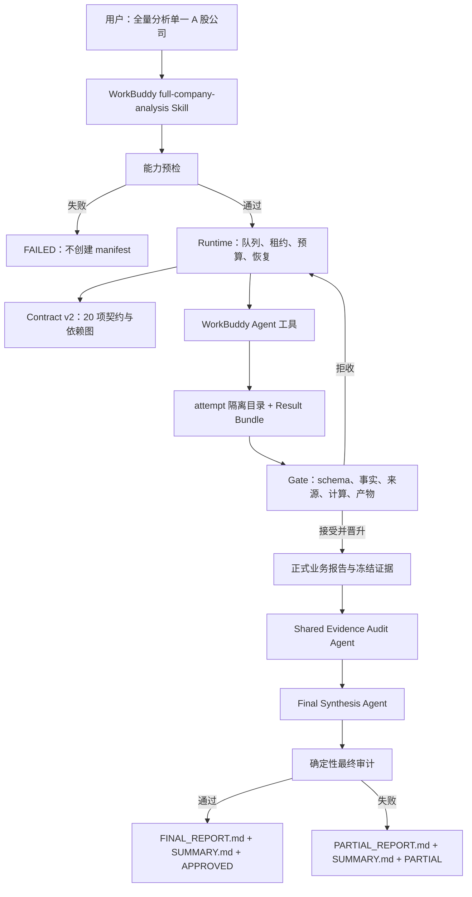

# 全量分析无人值守可靠性改造设计

> 日期：2026-07-23
> 状态：经 `grill-me` 逐项确认，待实施
> 优先策略：先稳定单公司全量分析主链路，再进入 21 个独立 Skill 的 Darwin 优化
> 适用范围：单一 A 股上市公司、单次运行、WorkBuddy 无人值守执行

## 1. 决策摘要

本次改造不再建设平台中性的 Python Agent Orchestrator。生产架构固定为：

- `workbuddy-skills/full-company-analysis/SKILL.md` 是唯一生产编排器，直接调用
  WorkBuddy 原生 Agent 工具；
- `tools/full_analysis_runtime.py` 只负责队列、租约、预算、重试、恢复和事件记录；
- `tools/full_analysis_gate.py` 只负责业务状态、事实/来源/计算/产物登记和准出；
- `tools/full_analysis_contract.json` 是 20 项业务契约的唯一机器真源；
- Agent 只写 attempt 隔离目录并提交版本化 Result Bundle；
- 正式产物只有经过 Gate 校验后才能原子晋升；
- Codex 和 Claude Code 继续支持 20 个业务 Skill、确定性工具和报告读取，但不承诺
  无人值守全量编排；非 WorkBuddy 环境不得静默单上下文代跑并宣称完成。

首版不保留旧编排器兼容层，也不支持 v1 manifest 迁移。旧的仓库外
`~/.workbuddy/berkshire-skill-sync/orchestrate.py` 及其专用辅助文件在新实现通过
本地测试后直接清理。用户已声明自行持有备份，本项目不再创建额外备份或运行时回退。

## 2. 背景与证据

三次真实全量分析共记录 53 个症状项。表面问题包括：

- Tushare 插件不可达或实际 Python 环境无法导入；
- `auto-enrich` 在 `ashare-data` 已完成后无法运行，形成确定性时序死锁；
- `set-industry` 收不到已登记的 fact ID；
- `reference-freeze` 依赖字段类型漂移和手工补值；
- `assigned_artifacts` 在字符串数组与对象数组之间漂移；
- calculation JSON 与 `financial_rigor.py` schema 不一致；
- 固定标题子串导致数百项 required-section 失败；
- 多角色文件名、角色名和实际 Agent 上下文不一致；
- Agent 超时、429 和迟到结果需要人工接管；
- `report_audit.py` 被错误地用文件路径代替 CLI 子命令调用；
- 最终输出散落，用户无法快速找到一份完整报告。

Darwin 对 21 个 Skill 的评估显示，只有 5/21 相对无 Skill baseline 为正迁移，
16/21 为负迁移。重复确认、格式性约束、运行时契约不一致和长模板是主要原因。

仓库现有 `bash scripts/check.sh` 能通过单元测试、frontmatter、生成物同步和契约
检查，但真实生产路径依赖仓库外、未受版本控制的 1,866 行
`~/.workbuddy/berkshire-skill-sync/orchestrate.py`。这说明当前测试覆盖的是仓库内
组件，而不是 WorkBuddy 实际运行控制面。

## 3. 根因

53 个症状归并为八类结构性根因：

1. **控制面分裂**：生产编排逻辑位于仓库外，仓库测试无法约束。
2. **状态所有权混乱**：Agent、外置编排器和 Gate 都能间接修改 manifest。
3. **契约多真源**：标题、角色、fact、计算和产物分别存在于 contract、prompt、
   外置常量和补丁脚本。
4. **先写报告、后补证据**：facts、calculations、artifacts 靠事后启发式提取，
   类型和来源不可控。
5. **数据生命周期错误**：数据补强晚于 Skill 完成，运行窗口又绑定 Skill 状态。
6. **调度无界**：缺少并发、租约、预算、429 冷却、迟到结果拒收和总时限。
7. **执行模式冲突**：顶层已获得只读研究授权，子 Skill 仍反复等待确认。
8. **末端才失败**：缺陷直到 checkpoint/finalize 才集中爆发，失败产物还可能被
   包装成“完成”。

## 4. 目标、成功标准与非目标

### 4.1 产品目标

用户在 WorkBuddy 中明确要求“全量分析”并提供可唯一识别的 A 股公司后，系统自动：

1. 完成能力预检；
2. 创建单次 run；
3. 执行 20 项业务契约的适用性判定、研究和验收；
4. 完成共享证据审计、计算复算和最终综合；
5. 输出一个可读的最终报告和一个确定性的运行摘要；
6. 在失败、限流、超时、预算或时间耗尽时诚实收口，不永久挂起。

### 4.2 机器成功标准

一次运行只有同时满足以下条件才可进入 `APPROVED`：

- 运行对象是唯一的 `.SH`、`.SZ` 或 `.BJ` A 股上市公司；
- 预检证明 WorkBuddy Agent、后台只读 Web、attempt 目录写入、数据 CLI、
  `financial_rigor.py` 和 `report_audit.py` 可用；
- 关键实现和契约哈希在运行期间未漂移；
- 所有适用业务契约为 `PASS` 或白名单内的 `PASS_WITH_LIMITATIONS`；
- 所有 N/A 都由 Gate 根据契约谓词生成；
- 所有强制独立多角色任务都有真实、独立的 Agent job 和产物；
- 核心事实、来源和计算可追溯，全部关键计算可复算；
- Shared Evidence Audit 通过；
- `FINAL_REPORT.md` 通过引用、数字、免责声明和结构审计；
- Agent job 不超过 50，wall clock 不超过 4 小时；
- 没有未登记写入、人工修补、迟到结果覆盖或失败产物冒充正式产物；
- `SUMMARY.md` 和 `status.json` 已确定性生成。

### 4.3 Live 验收标准

首个上线验收只执行一次格力电器 `000651.SZ` 的全新单公司运行，不做 3×3：

- `run_status=APPROVED`；
- `human_review=ACCEPTED`；
- 无运行中人工修补；
- 4 小时内结束；
- Agent job 不超过 50；
- 所有机器成功标准满足。

恒瑞医药和韦尔股份的既有报告只作为事故基线；后续可作为回归样本，但不属于首个
上线门槛。若格力电器失败，必须将新故障固化为 hermetic 回归、修复后启动全新 run；
不得在原 run 上补写后改判。

### 4.4 非目标

首版明确不做：

- 港股、美股、多市场、未上市公司或多公司全量分析；
- 私人组合读取、私有交易台账、自动调仓或交易；
- HTML、图表、暗色模式或发布系统；
- push、PR、publish、外部消息或表单提交；
- 跨 run Agent 产物、事实、计算或审计缓存；
- v1 manifest 原地迁移；
- Codex/Claude 与 WorkBuddy 的无人值守能力对齐；
- 自动删除历史 run 或 attempt；
- 在主链路验收前继续做独立 Skill 的大范围 Darwin 改写。

## 5. 治理定位

本仓库按 `product` profile 处理：

- 沿用现有本地检查和安全边界；
- 不新增第三方依赖、hook、release、ADR 或独立 USAGE 文档；
- 当前设计文档是架构决策真源；
- 当前实施计划是执行顺序和验收真源；
- 实施完成后只更新现有 `README.md` 与 `docs/ROADMAP.md`；
- `skills/*.md` 仍是 Claude/Codex 业务 Skill 的 canonical source，修改后必须运行
  `python3 scripts/sync-codex-skills.py`；
- WorkBuddy 总控 Skill 的 canonical source 单独位于仓库
  `workbuddy-skills/full-company-analysis/SKILL.md`；
- `~/.workbuddy/skills/` 只保存显式安装的副本，不是源码真源。

## 6. 领域词汇与不变量

### 6.1 三类状态

状态必须分层，禁止混用。

**Runtime work unit 状态：**

`PENDING / RUNNING / RETRY_WAIT / READY_TO_INGEST / DONE / FAILED / ABANDONED`

**Manifest 业务执行状态：**

`PENDING / RUNNING / COMPLETE / BLOCKED`

**业务契约验收状态：**

`PASS / PASS_WITH_LIMITATIONS / NOT_APPLICABLE / FAIL`

**顶层运行状态：**

`RUNNING / APPROVED / PARTIAL / FAILED`

`COMPLETE` 只表示合法 Result Bundle 已被原子收取，不等于业务通过。最终业务状态只能
由 Gate 计算。

### 6.2 核心不变量

1. WorkBuddy Skill 是唯一 Agent 编排器；Python 不生成或模拟 Agent。
2. Runtime 是运行状态单写者；Gate 是 manifest、正式注册表和准出状态单写者。
3. Agent 只能写自己 attempt 的 staging 目录。
4. 正式目录只接受 Gate 原子晋升。
5. Agent 不能创建、改名或合并 Runtime 分配的 fact ID。
6. Main Orchestrator Agent 不能代写失败研究、补标题或伪造角色。
7. 多角色 Skill 缺任一强制角色即失败，不允许单上下文 fallback 获得 PWL。
8. 失败 run 不得生成 `FINAL_REPORT.md`。
9. 所有业务事实、计算和产物必须由稳定 ID 连接。
10. 所有时间、预算、重试和降级都必须写入事件日志和 SUMMARY。

## 7. 目标架构



### 7.1 WorkBuddy 总控 Skill

`workbuddy-skills/full-company-analysis/SKILL.md`：

- 识别单公司请求并调用本地预检；
- 从 Runtime 领取最小 Work Packet；
- 直接调用 WorkBuddy Agent 工具；
- 只从子 Agent 接收短回执：
  `attempt_id / result_path / status / bytes`；
- 不读取角色全文，不在主上下文中拼接报告；
- 不为不同 Skill 硬编码模型，使用 WorkBuddy 当前默认配置；若 Agent 回执提供实际
  model ID，则写入运行记录；
- 将回执交给 Runtime/Gate 验证；
- 按 Runtime 给出的下一工作单元继续；
- 在终态只返回 `FINAL_REPORT.md` 或 `PARTIAL_REPORT.md`，随后返回 `SUMMARY.md`。

WorkBuddy 主上下文不能修改 manifest、facts、sources、calculations 或正式报告。

### 7.2 Runtime

`tools/full_analysis_runtime.py`：

- 创建并读取 run-root；
- 从 Contract 生成依赖图和 Work Packet；
- 管理 work unit、attempt、lease、heartbeat、retry 和 budget；
- 维护 `runtime-state.json` 快照和追加式事件日志；
- 进行文件锁和 session 接管校验；
- 拒收迟到 attempt、错误 job ID、错误 lease nonce 和版本漂移；
- 调用 Gate 接收 Result Bundle；
- 不判断业务 PASS/PWL/N/A/FAIL；
- 不生成研究结论。

### 7.3 Gate

`tools/full_analysis_gate.py`：

- 原位升级为 Contract/manifest v2，不保留 v1 写兼容；
- 维护 manifest、facts、sources、calculations 和 artifacts 注册表；
- 检查 Result Bundle schema、路径、哈希、来源、fact ID、计算请求和章节 ID；
- 执行 `financial_rigor.py` 并保存 calculation envelope；
- 校验报告引用的格式化数字与 envelope 一致；
- 对合法产物执行 staging → formal 的原子晋升；
- 计算单项契约和顶层运行状态；
- 调用稳定的 `report_audit` 函数接口；
- 确定性生成 `SUMMARY.md`、`PARTIAL_REPORT.md` 和 `status.json`；
- 只在最终综合通过时晋升 `FINAL_REPORT.md`。

### 7.4 Contract v2

`tools/full_analysis_contract.json` 是以下内容的唯一机器真源：

- 20 项业务 Skill 清单；
- 依赖关系和适用性谓词；
- 稳定 fact slot 和 source requirement；
- 稳定 artifact ID 与正式路径；
- 机器关键 section ID；
- 多角色清单和 integrator/editor/reader 规则；
- calculation request；
- PWL 白名单；
- audit policy；
- 核心/研究增强/派生分类。

Runtime、Gate、WorkBuddy Skill 和测试不得复制另一份 20 项清单、角色表或标题表。

### 7.5 业务 Skill

20 个 canonical `skills/*.md` 只增加统一的最小适配规则：

- 当 `execution_mode=UNATTENDED_FULL_ANALYSIS` 时，顶层已经授权公开只读研究、
  Agent 启动和已分配 run-root 写入；
- 不再重复等待确认；
- 必须遵守 Work Packet、稳定 ID 和 Result Bundle；
- 不得扩大到发布、交易、敏感信息或未分配路径；
- 单独调用 Skill 时保留原交互和输出行为。

`skills/full-company-analysis.md` 保留为 Claude/Codex 兼容说明，但必须明确：
非 WorkBuddy 环境不支持无人值守总控，不能静默以单上下文完成。

## 8. 20 项业务契约

### 8.1 固定清单

| 分组 | Skill |
|---|---|
| 数据与基础 | `ashare-data`、`financial-data`、`quality-screen`、`investment-checklist` |
| 核心研究 | `investment-research`、`investment-team`、`management-deep-dive`、`earnings-review`、`earnings-team`、`industry-research`、`news-pulse`、`thesis-tracker` |
| 研究增强与派生 | `industry-funnel`、`bottleneck-hunter`、`deep-company-series`、`dyp-ask`、`wechat-article` |
| 条件 N/A | `portfolio-review`、`private-company-research`、`thesis-drift` |

`full-company-analysis` 是总控，不计入 20 项。Shared Evidence Audit 和 Final
Synthesis 是系统工作单元，不计入业务 Skill 数，但计入 Agent job 预算。

### 8.2 适用性

- `industry-funnel` 正常执行；“从全市场筛到 3 家”只提供相对位置参考，不扩展为
  另外两家公司的全量分析。
- `bottleneck-hunter` 仅在 `industry-research` 识别出明确且可验证的物理、
  技术、牌照或产能瓶颈时执行，否则由 Gate 生成标准 N/A。
- `portfolio-review` 在未提供私人组合时 N/A。
- `private-company-research` 对本版 A 股上市公司固定 N/A。
- `thesis-drift` 在不存在前序可配对 thesis snapshot 时 N/A。
- 不适用项不派发 Agent，不消耗 job。

### 8.3 强制多角色

- `investment-team`：4 个独立视角 Agent + 1 个 integrator；
- `earnings-team`：4 个独立视角 Agent + 1 个 editor + 1 个 reader；
- `news-pulse`：4 个独立 scout + 1 个 integrator；
- `management-deep-dive`：1 个研究 Agent，另由 Shared Evidence Audit 独立核验；
- `deep-company-series`、`dyp-ask`、`wechat-article`：各 1 个派生内容 Agent。

独立角色只读取各自的最小输入，不能读取其他角色产物。Integrator 只能读取其所属
角色的已接受结果和冻结 facts。角色草稿留在 `evidence/attempts/`，正式目录每个 Skill
只保留 Gate 接受的最终报告。

`earnings-team` reader 的意见写入 `evidence/audit/`；若拒绝，最多派发一次新的 editor
attempt。主 Agent 不得代改。

### 8.4 数据流方向

- `industry-funnel` 和条件适用的 `bottleneck-hunter` 可为最终综合提供研究增强，
  但不能替代缺失的核心事实或改变唯一标的；
- `deep-company-series`、`dyp-ask` 和 `wechat-article` 只消费冻结证据，不能反向
  写入核心 fact、valuation input 或投资结论。

## 9. Contract v2 与 Result Bundle

### 9.1 稳定 section ID

不再要求每个方法论标题精确匹配。只有机器关键内容使用稳定 section ID：

- 数据截止日；
- 来源与研究范围；
- 限制；
- 学习研究免责声明；
- 核心结论；
- 被下游消费的证据；
- 契约明确要求的计算或审计段。

展示标题可调整，但稳定 ID 不变。其余方法论深度通过 checklist、fact、source、
calculation、judgment 和最低证据规则验收，不用标题字符串替代内容质量。

### 9.2 Fact ID

- Contract 预声明强制 fact slot；
- Runtime 在 Work Packet 中分配稳定 fact ID；
- Agent 只能填写 value、unit、period、scope、source IDs 和 confidence；
- Agent 不能改名、合并或重用 ID；
- 可选发现使用命名空间 `skill.extra.*`；
- Gate 在 Agent 启动前检查其输入 fact 是否已存在，禁止空 ID 进入下游。

### 9.3 Result Bundle v1

必填字段：

```json
{
  "schema_version": "result-schema/v1",
  "run_id": "run-id",
  "work_unit_id": "unit-id",
  "attempt_id": "attempt-id",
  "agent_job_id": "workbuddy-job-id",
  "lease_nonce": "opaque-nonce",
  "skill_id": "investment-research",
  "role_id": "primary",
  "status": "SUCCEEDED",
  "artifact_records": [],
  "fact_updates": [],
  "source_records": [],
  "calculation_requests": [],
  "judgments": [],
  "limitations": [],
  "pwl_candidates": [],
  "started_at": "ISO-8601",
  "completed_at": "ISO-8601",
  "error": null
}
```

规则：

- 未知字段可记录，但不参与验收；
- 缺必填字段直接拒收；
- schema 版本不一致不得猜测或原地迁移；
- artifact 记录必须包含稳定 artifact ID、attempt 相对路径、类型、字节数和 SHA-256；
- Agent 只提交 calculation request，不提交 `expected.result`；
- 失败时 `error` 必填；
- attempt ID、job ID 和 lease nonce 必须与当前租约一致。

## 10. 运行目录与文件所有权

run-root 固定为：

`local/company/<股票代码>-<公司简称>/<YYYYMMDD-HHMMSS>-<短随机ID>/`

例如：

`local/company/000651.SZ-格力电器/20260723-103000-a1b2c3/`

Runtime 命令必须使用明确 run ID；不得仅凭公司名自动选取“最新”运行。

```text
<run-root>/
├── evidence/
│   ├── 00-analysis-manifest.json
│   ├── runtime-state.json
│   ├── events.jsonl
│   ├── facts.json
│   ├── sources.json
│   ├── calculations.json
│   ├── artifacts.json
│   ├── snapshots/
│   ├── preflight/
│   ├── commands/
│   ├── sources/
│   ├── work-packets/
│   ├── attempts/
│   │   └── <skill>/<attempt-id>/
│   │       ├── prompt.md
│   │       ├── result.json
│   │       ├── events.jsonl
│   │       └── artifacts/
│   └── audit/
├── 01-数据与快筛/
├── 02-公司与财报/
├── 03-行业与机会/
├── 04-论文与组合/
├── 05-内容生产/
├── FINAL_REPORT.md 或 PARTIAL_REPORT.md
├── SUMMARY.md
└── status.json
```

正式目录映射：

| 目录 | Skill |
|---|---|
| `01-数据与快筛/` | ashare-data、financial-data、quality-screen、investment-checklist |
| `02-公司与财报/` | investment-research、investment-team、management-deep-dive、earnings-review、earnings-team |
| `03-行业与机会/` | industry-research、industry-funnel、bottleneck-hunter、news-pulse |
| `04-论文与组合/` | thesis-tracker、thesis-drift、portfolio-review、private-company-research |
| `05-内容生产/` | deep-company-series、dyp-ask、wechat-article |

每个正式文件名以稳定 Skill ID 开头。所有角色草稿、失败产物、prompt、日志和命令回执
只存在于 `evidence/`。N/A 在对应正式目录生成标准负向验收回执。

系统不自动删除 attempt 或历史 run。`cleanup <run-id> --dry-run` 只列出候选；
实际清理必须由用户明确指定 run ID 和执行参数。SUMMARY 必须报告中间产物总大小。

默认不保存完整 Agent transcript、隐藏推理或完整工具日志。每个 attempt 只保留
Work Packet/prompt、job/context ID、时间和 heartbeat、结构化错误、最终角色产物、
Result Bundle 与哈希。`debug_transcript=true` 只能对单个 run 显式启用，内容仍为
local-only，且不得改变验收结论。

## 11. 单写者、并发与恢复

### 11.1 单写者

- 子 Agent 只能写自己 attempt 目录；
- Runtime 串行收取结果并追加事件；
- Gate 串行更新正式注册表和业务状态；
- 同一 run 只能由一个 WorkBuddy 主会话持有驱动锁；
- 第二个会话只允许读取状态。

首版不引入数据库。状态使用原子 JSON 快照、追加式 JSONL 和本地文件锁。

### 11.2 Attempt 和迟到结果

- Agent 写 attempt 隔离目录；
- Gate 验证后才原子晋升；
- 旧 attempt 失去租约后标记 `ABANDONED`；
- 迟到结果即使内容完整，只要 attempt ID 或 lease nonce 不匹配就拒收；
- 正式路径不允许 Agent 直接写入；
- WorkBuddy 文件系统无法提供密码学写入身份，本系统只承诺可审计检测，不声称强证明。

### 11.3 Resume

WorkBuddy 重启后，用户可以明确说“恢复 `<run-id>`”。这属于运行控制，不算人工修补。
恢复必须满足：

- 原驱动锁已失效；
- WorkBuddy Skill、Runtime、Gate、Contract、Result schema、
  `financial_rigor.py`、`report_audit.py`、数据 CLI 哈希完全一致；
- 已完成且验证通过的 Result Bundle 可复用；
- 原 RUNNING attempt 变为 `ABANDONED`；
- 未完成 work unit 使用新 attempt 重派；
- 暂停不超过 24 小时。

暂停超过 24 小时或任一关键版本不同，只允许只读状态诊断，必须创建新 run。

## 12. 调度、预算与时限

### 12.1 基本参数

- 固定最大并发：2 个 Agent；
- 遇到 429 后并发降为 1；
- 429 冷却：10 分钟；
- 每个 work unit 最多 3 个 attempt；
- 失败退避：60 秒、180 秒，持续限流进入 600 秒全局冷却；
- lease：20 分钟；
- 主会话通过 Agent job 状态更新 heartbeat 并延长 lease；
- 正常目标：约 40 个 Agent job；
- 硬上限：50 个 Agent job；
- 单公司目标：3 小时内；
- 单公司硬上限：4 小时。

每一次真实子 Agent 调用都计 1 job，包括角色、integrator、editor、reader、Audit、
Final Synthesis、定向修复和所有重试。Agent 启动即消耗额度，失败不退还。
Runtime/Gate/CLI/计算、N/A 和只读 status 不计入。

能力预检使用的 Agent probe 在成功创建 run 时记为已用 1 job；预检失败则不创建
manifest。

### 12.2 预算预留

Runtime 始终计算剩余核心工作的最小 job 数，并预留：

- 1 个 Shared Evidence Audit；
- 1 个 Final Synthesis；
- 1 个 Final Synthesis 定向修复。

非核心任务只有在不会侵占核心最低需求和预留额度时才能派发。

- 达到 45 个 job：停止所有新的非核心派发和重试，只完成核心研究、审计、综合及其
  契约内修复；
- 达到 50 个 job：无条件停止新派发，生成 `PARTIAL_REPORT.md + SUMMARY.md`，
  本次验收失败；
- 达到 4 小时：行为与 50 job 相同。

预算耗尽不属于允许的 PWL。任何适用非核心契约因此未完成，顶层只能 `PARTIAL`。

### 12.3 调度模型

不再使用固定 L1–L6 整层等待。Runtime 使用依赖图，并保留三个硬屏障：

1. 公司身份与数据能力预检；
2. 核心事实、来源与计算冻结；
3. 独立证据审计与最终准出。

依赖满足的 Skill 可立即入队；一个非关键任务不会卡住同层全部工作。

## 13. 数据、来源与计算

### 13.1 Tushare

Tushare 是增强来源，不是硬依赖：

- 预检执行实际数据命令，不通过 `import ashare_plugin` 判断；
- 可用则使用；
- 已配置但不可用时记录 `tushare_unavailable`；
- 腾讯、东方财富和巨潮等既有来源满足独立性和契约要求时可 PWL；
- 无替代证据或核心事实只有单源时 FAIL。

### 13.2 新鲜度

- 行情、股价、市值：`as_of` 最近一个已收盘交易日；
- 财务数据：截至 `as_of` 已正式披露的最新定期报告；
- 公告与监管事件：截至 `as_of`，重点覆盖近 12 个月及更早的持续重大事项；
- 新闻与市场事件：重点覆盖近 90 天，必要时回溯 12 个月；
- 财务历史：至少 5 年，年报与资本配置尽量覆盖 10 年；
- 无法证明取得截至当时最新可得数据时标记 `stale_data`，该状态不得 PWL。

`as_of` 在 init 时冻结。跨午夜不自动刷新。Agent 的 `accessed_at` 单独记录。

### 13.3 独立来源

- 同一原始数据的转载、镜像和聚合不算独立；
- 公司公告与交易所转载的同一公告只算一个主来源；
- 核心财务数字使用公司/交易所正式披露为主源，再由独立数据服务或计算链交叉验证；
- 行情和估值使用两个独立获取渠道，或一个行情主源加独立股本/价格复算；
- 来源冲突保留差异并由 Gate 按口径和容差裁决，不取平均掩盖；
- primary PDF、公告和年报保存到 `evidence/sources/` 并计算 SHA-256；
- Web/news 只保存 URL、标题、发布者、访问时间、短相关摘录和哈希，不保存整页；
- 市场/API 保存 Gate 拥有的 receipt 或结构化原始输出；
- 无法保存的 source 标记 `ephemeral_source`，不能作为核心结论唯一依据。

### 13.4 计算

- Contract 预声明关键 calculation request；
- Gate 在研究前预计算必要结果；
- Agent 只能引用 calculation ID 或提交新 request 的 operation + args；
- Gate 执行 `financial_rigor.py`，保存唯一 envelope；
- 报告只能使用 Gate 格式化后的结果；
- 每个 calculation 契约声明币种、单位、期间、口径、输入精度、展示舍入和容差；
- 未声明容差时严格一致；
- 计算错误只允许一次本地定向修复报告 attempt，不重跑完整研究；
- 报告数字与 envelope 不一致时拒收。

估值必须包含保守、基准、乐观三情景，分别记录收入/业务量、利润率/现金流、
资本成本或倍数、期限/终值、估值区间、安全边际、敏感变量和失效条件。不能只给单点
目标价；无法形成可审计区间时不得 `APPROVED`。

## 14. PWL、N/A 与失败

### 14.1 PWL 白名单

仅允许：

- `tushare_unavailable`：独立替代来源充分；
- `web_bandwidth_degraded`：关键事实已有 primary source；
- `ephemeral_source`：不是核心事实唯一依据。

禁止 PWL：

- `single_context_fallback`；
- `missing_required_source`；
- `audit_insufficient`；
- `calculation_unverified`；
- `stale_data`；
- `partial_artifact`；
- `role_missing`；
- `manual_intervention`；
- `budget_exhausted`。

### 14.2 人工干预

公司身份和启动请求发生在 init 前，不算干预。`status` 和符合规则的 `resume` 只属于
运行控制。init 至终态期间，以下行为记为 `manual_intervention`：

- 用户或主 Agent 修改 fact、section、artifact、状态或计算；
- 手工重置失败 attempt；
- 主 Agent 替代失败研究 Agent 写报告；
- 手工登记产物或跳过 Gate；
- 未登记写入正式目录。

系统通过 job/context ID、attempt ID、lease nonce、哈希和正式目录 watch 进行审计
检测，但不声称具备密码学作者证明。

## 15. 审计与最终准出

### 15.1 审计顺序

固定单向流水线：

1. 所有适用研究产物经 Gate 接受并冻结；
2. Shared Evidence Audit Agent 审计事实、来源和判断；
3. Gate 复算全部 financial_rigor calculations；
4. 审计通过后，Final Synthesis Agent 只读取已接受的核心材料；
5. 综合稿写入独立 attempt staging；
6. Gate 检查引用、数字、免责声明和结构；
7. 最多允许一次只修复综合报告自身格式/引用的 attempt；
8. 通过后晋升 `FINAL_REPORT.md`，否则生成 `PARTIAL_REPORT.md`。

### 15.2 Audit Agent 范围

- 100% 审计估值输入、核心财务指标、股本与市值、管理层关键事实、重大风险和所有
  `eligible_for_final=true` 的事实；
- 100% 复算所有计算；
- 未进入最终结论的普通事实按确定性种子抽样 10%，且不少于 5 条；
- 所有高严重度来源冲突逐项审计；
- 普通抽样失败时扩展为同类事实全检；
- 任一核心事实失败即阻止综合；
- 抽样种子、fact ID、来源和结果写入 `evidence/audit/`。

Audit Agent 只看抽中的事实和来源，不看作者结论，以保持独立性。Final Synthesis
只能引用审计结果为 PASS 的事实；最终 Gate 再逐个检查实际引用均属于该集合，因此
最终报告实际使用的事实仍达到 100% 审计覆盖。

### 15.3 report_audit 接口

`report_audit.py` 提供稳定 Python 函数和明确 CLI 子命令。Gate 使用函数接口并按
manifest 中已登记的 artifact ID 审计，不自行扫描未知目录，也不把文件路径当作
CLI 命令。结构化结果统一写入 `evidence/audit/`。

## 16. 交付物

### 16.1 FINAL_REPORT.md

不设字数上下限，以完整性、证据密度和可读性验收，不以篇幅判定通过。目标结构：

1. 执行摘要与结论；
2. 公司与业务边界；
3. 核心事实与数据截止日；
4. 财务质量；
5. 护城河与竞争；
6. 管理层与资本配置；
7. 行业、政策与新闻；
8. 四视角分歧；
9. 估值与三情景；
10. 风险、反证与触发器；
11. 数据限制与 PWL；
12. 报告和证据索引。

结论可以给出研究判断、估值区间、观察/等待/回避和反证触发器；不得给出个性化立即
交易指令、仓位比例、私人组合再平衡或自动交易。

核心事实使用稳定引用：

- `[F:fact_id]`
- `[S:source_id]`
- `[C:calculation_id]`

文末自动生成事实、来源和计算索引，包含链接、访问日期、页码或公告编号及文件哈希。
普通分析性文字无需逐句引用。

### 16.2 SUMMARY.md

完全由 Runtime/Gate 确定性生成，至少包含：

- 顶层状态与人工评价状态；
- 20 项 PASS/PWL/N/A/FAIL 矩阵；
- N/A 谓词依据；
- Agent job、attempt、重试、429 和超时；
- wall clock 和中间产物大小；
- PWL、人工干预和失败原因；
- 关键实现版本与哈希；
- 正式报告、证据和审计链接。

### 16.3 PARTIAL_REPORT.md

由 Runtime 确定性生成，不再消耗 Agent job。必须醒目标注“未准出”，包含已验证事实、
已通过报告链接、失败/未完成 Skill、未验证计算、来源和审计缺口以及下一次诊断建议。
不得生成综合投资结论、估值立场或观察/等待/回避建议。

### 16.4 人工质量评价

机器状态和人工质量分离：

- `run_status=APPROVED/PARTIAL/FAILED/RUNNING`
- `human_review=PENDING/ACCEPTED/REJECTED`

人工只做接受/拒绝，不编辑原报告后改判。机器 APPROVED 但人工 REJECTED 时，原 run
状态不篡改，首个上线验收仍失败。

## 17. 预检、安装与版本漂移

### 17.1 预检

init 前必须证明：

- WorkBuddy Agent 工具可调用；
- 后台 Agent 可执行公开只读 Web；
- Agent 可写入唯一 probe attempt 目录；
- `financial_rigor.py`、`report_audit.py` 和数据 CLI 可运行；
- 执行过程中不需要新的权限确认；
- canonical WorkBuddy Skill、安装副本和关键实现哈希一致。

缺一项即在创建 manifest 前失败，并列出精确缺失能力。系统不得修改 WorkBuddy
全局权限。

### 17.2 安装

新增 `scripts/install-workbuddy-skills.sh`：

- 无参数只预览差异，不写入；
- `--check` 只读比较 canonical source 与安装副本；
- 用户明确执行 `--install` 后才安装到 `~/.workbuddy/skills/`；
- 不监听、不自动同步、不修改权限；
- 其余 20 个业务 Skill 继续使用现有 `berkshire-skill-sync/sync.py`。

### 17.3 关键哈希

run 冻结：

- WorkBuddy full-company-analysis Skill；
- Runtime；
- Gate；
- Contract；
- Result schema；
- `financial_rigor.py`；
- `report_audit.py`；
- 数据 CLI。

无关工作树改动、其他 Skill 编辑或 `local/` 文件不影响运行。关键哈希变化时停止新
派发并生成未准出摘要，不允许热迁移或继续 resume。

## 18. 用户入口

WorkBuddy 用户只看到：

- `start`：清晰公司/代码时直接预检并启动，不再二次确认；
- `status <run-id>`：只读查看；
- `resume <run-id>`：满足恢复条件时继续；
- `cleanup <run-id> --dry-run`：预览清理。

模糊身份、私人数据或 HARD STOP 才向用户提问。计划、预算和 run ID 写入启动回执，
不是确认 checkpoint。

`next-work`、`heartbeat`、`submit-result`、`ingest`、`audit` 和 `finalize` 是
WorkBuddy Skill 与 Runtime/Gate 的内部接口，不作为手工修复入口。删除
`set-industry`、`reference-freeze`、`finish-skill` 等可绕过新状态机的用户入口。

## 19. 测试策略

### 19.1 单元与集成

覆盖：

- Contract v2、20 项清单、N/A 和 PWL；
- Result Bundle、fact/source/calculation/artifact 注册；
- attempt 隔离、原子晋升和迟到拒收；
- Runtime 状态、锁、lease、resume 和版本漂移；
- 429、退避、并发、45/50 job 和 4 小时；
- 多角色独立性；
- data freshness、Tushare fallback 和来源独立性；
- audit sampling、最终综合和 deterministic SUMMARY。

### 19.2 Hermetic E2E 与故障注入

使用提交到仓库的脱敏小型 fixture 和 fake WorkBuddy receipt，不联网、不依赖旧完整
报告。至少注入：

- 正常完成与合法 N/A；
- 429 降并发、冷却和重试；
- Agent timeout、heartbeat 中断和 lease 过期；
- app 重启、ABANDONED 和合法 resume；
- 迟到 attempt、错误 lease nonce 和重复提交；
- Result Bundle 缺字段、版本错误和 artifact 哈希错误；
- facts 为空、fact ID 改名和机器关键 section 缺失；
- calculation request、数字不一致和一次定向修复；
- 未登记写入和 `manual_intervention`；
- 关键版本漂移；
- 45/50 job 和 4 小时收口；
- Tushare 不可用但替代来源充分；
- 核心失败时绝不生成 FINAL；
- 全链路成功时正式目录无 attempt 或半成品。

Hermetic E2E 必须进入 `bash scripts/check.sh`。实时网络运行不进入普通 CI。

### 19.3 Live canary

只执行一次格力电器 `000651.SZ`。checker 验证机器状态、人工评价、时间、job、
PWL、审计、版本、产物和人工干预。失败后不得改原 run；先把故障加入 fixture，再
创建新 run。

## 20. 迁移与直接清理

迁移顺序：

1. 在仓库完成 Contract v2、Runtime、Gate、WorkBuddy Skill 和 hermetic E2E；
2. 运行完整本地检查；
3. 直接删除仓库内旧 `scripts/run_full_analysis.py` 和
   `scripts/batch_full_analysis.py`，由 `scripts/full_analysis.py` 取代；
4. 清理仓库外旧编排专用文件：
   - `~/.workbuddy/berkshire-skill-sync/orchestrate.py`
   - `_run_l1.py`
   - `_verify.py`
   - `cleanup_intermediate_dirs.py`
   - `skills/full-company-analysis.md`
   - `MIGRATE-full-company-analysis.md`
   - `FULL-ANALYSIS-REPORT.md`
5. 从外部 `sync.py`、`README.md` 和 `CHANGELOG.md` 删除旧 full-company 编排生成和
   调用逻辑，但保留其余 20 个业务 Skill 同步；
6. 删除已安装的旧 `~/.workbuddy/skills/full-company-analysis/`；
7. 使用新的显式安装工具安装仓库 canonical WorkBuddy Skill；
8. 运行 `--check`、预检和 hermetic 验证；
9. 执行格力电器单次 live canary。

不保留 wrapper、dual-run、shadow 或旧入口回退。历史 `local/` 报告和未跟踪文件不
删除。用户已声明自行持有旧外置实现备份；项目不验证或复制该备份。

## 21. 风险与缓解

| 风险 | 概率×影响 | 缓解 |
|---|---:|---|
| WorkBuddy Agent 工具行为无法由 Python 单测完整模拟 | 2×3 | capability probe、fake receipt E2E、单次 live canary |
| Runtime/Gate 状态损坏或并发写 | 2×3 | 单写者、原子快照、JSONL、文件锁、attempt 隔离 |
| 429、超时和多角色消耗预算 | 3×2 | 并发 2、降为 1、10 分钟冷却、预算预留、45/50 门槛 |
| 形式合规掩盖事实错误 | 2×3 | 稳定事实/来源/计算 ID、独立 Audit Agent、全量复算 |
| 机器 APPROVED 但报告不可用 | 2×3 | 独立 `human_review`，格力 canary 必须 ACCEPTED |
| 文件系统无法证明真实作者 | 2×2 | attempt/job/lease/hash 审计，明确“可检测、非密码学证明” |
| 旧编排器直接删除后无法由项目恢复 | 1×3 | 用户自有备份；迁移前完成新实现和本地 E2E |
| Contract v2 使旧 run 不可恢复 | 2×2 | 旧 run 只读；新 run 冻结版本；不做隐式迁移 |
| 非交互模式误放宽权限 | 1×3 | 只允许公开只读和分配路径；发布/交易/敏感信息继续 HARD STOP |

## 22. 后续 Darwin 阶段

格力电器 live canary 同时达到机器 APPROVED 和人工 ACCEPTED 后，才为独立 Skill
另写优化计划。目标保持：

- 带 Skill 相对 baseline 为正或持平的项目至少 16/21；
- 任一 Skill 的 d8 相对 baseline 降幅不超过 1；
- runtime 人工风险为 0；
- 优先处理 private-company-research、investment-research、earnings-review、
  investment-team 和 financial-data；
- 补 thesis-drift 成功路径；
- 压缩 private-company-research、bottleneck-hunter 和 earnings-team 的重复模板。

该阶段不与本次控制面、Contract v2 和 Runtime 改造混合实施。
